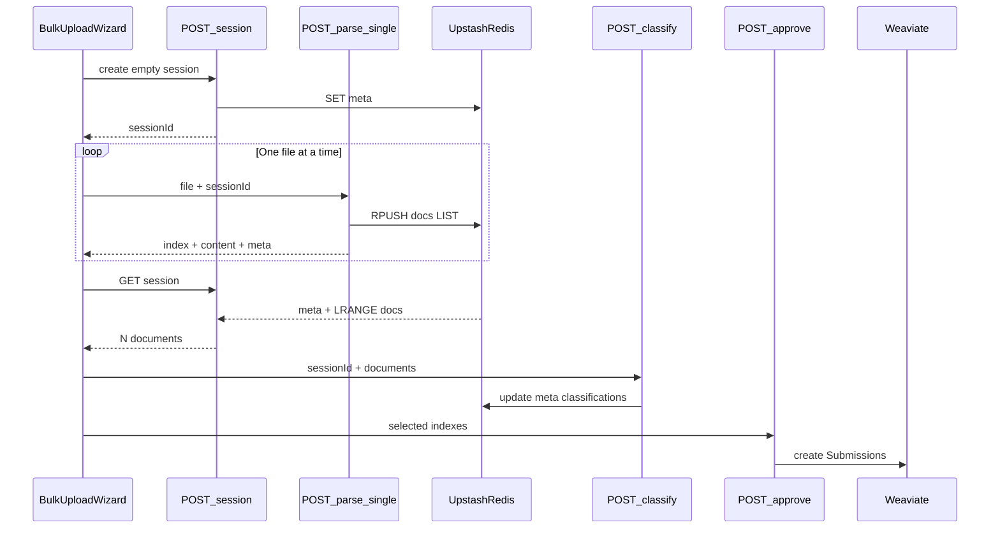

# TEMPORARY — Bulk Upload Investigation Briefing

> **Status:** Temporary scratch note — **not** product documentation.  
> **Created:** July 13, 2026  
> **Last updated:** July 14, 2026  
> **Do not** treat this as an ADR, roadmap source of truth, or user guide.  
> Delete or fold into real docs once the issue is resolved.

---

## 1. Purpose / current status

Multi-file **Bulk Upload** on production failed (or failed intermittently) after several shipped fixes. This note consolidates everything we know: symptoms, layered root causes, fixes attempted, success criteria, and the tech stack involved.

**User-visible errors observed over the investigation:**

| Message | What it usually means |
|---|---|
| `Failed to fetch` | Browser `fetch()` threw — no usable HTTP JSON response (network reset, body limit, middleware buffering, deploy not ready, etc.) |
| `Session not found or expired` | `parse-single` or session GET could not load the session from the store (often wrong instance / no Redis / race) |
| `No documents were parsed successfully` | Wizard finished upload loop but durable session (and/or local parse responses) had zero docs |

**Targeted fix shipped (2026-07-14):** Build unblock for the LIST + sequential upload lineage — `asUploadBlob()` replaces the invalid `value is Blob` predicate (TS2677), `UPLOAD_CONCURRENCY = 1` lives in `lib/bulk-upload-constants.ts`, and success-criteria tests cover delayed concurrent append + concurrency + `asUploadBlob`. This unblocks `next build` / Vercel deploys that previously ERROR’d while production alias stayed on Ready `571907e`.

**Next verification (still open):** Confirm production alias is Ready on a SHA that includes the targeted fix + `dde44ac` lineage, then re-run signed-in 2+ file E2E (criteria A–E). Do not treat intermittent success on `571907e` as proof the race is gone.

---

## 2. Success criteria (definition of done)

Happy path: **N ≥ 2** supported files through the full wizard → pending submissions in `/queue`.

| ID | Criterion | How to verify |
|---|---|---|
| **A** | Preconditions | Signed-in user with **contributor+** role; files `.md` / `.pdf` / `.docx` / `.txt`; each ≤ **4 MB**; batch ≤ **50** files and ≤ **100 MB** total |
| **B** | Durable session create | `POST /api/bulk-upload/session` → `200` + `sessionId`; that id is readable by later requests on **any** serverless instance |
| **C** | Per-file parse durability | Each successful `POST /api/bulk-upload/parse-single` appends one doc; `GET /api/bulk-upload/session/{sessionId}` returns **N** documents for N successful parses |
| **D** | Classification | Classify SSE completes; classifications stored on the session |
| **E** | Approve → queue | Approve creates pending **Weaviate** Submissions; they appear in `/queue` |

Store-layer tests lock **B–C** only (`__tests__/lib/bulk-upload-success-criteria.test.ts`). Passing unit tests **does not** prove production.

---

## 3. Technologies and services

### Application

| Layer | Choice |
|---|---|
| Framework | **Next.js 16** (App Router), **TypeScript** |
| UI | React client wizard at `/bulk-upload`; Tailwind CSS v4 |
| Deploy | **Vercel** — production URL `https://content-automation-app-zeta.vercel.app` |
| Auth | **Auth.js v5** (`next-auth@beta`), Google OAuth, JWT sessions |
| Auth enforcement | Edge [`middleware.ts`](../middleware.ts) for most routes; multipart parse routes **excluded** from middleware matcher; route handlers call `requireRole("contributor")` via [`lib/auth-server.ts`](../lib/auth-server.ts) |

### Upload session store

| Item | Detail |
|---|---|
| Service | **Upstash Redis** (REST API) |
| Client | `@upstash/redis` |
| Env vars | `UPSTASH_REDIS_REST_URL`, `UPSTASH_REDIS_REST_TOKEN` |
| Implementation | [`lib/upload-session.ts`](../lib/upload-session.ts) |
| TTL | 24 hours |
| Production rule | Redis **required** on Vercel/`NODE_ENV=production`; otherwise session create throws → API **503** |
| Local fallback | In-memory `globalThis` Map (not durable across serverless instances) |

**Current Redis key layout (post-`dde44ac`):**

- `upload-session:{id}:meta` — status, classifications, userEdits, timestamps (JSON)
- `upload-session:{id}:docs` — **Redis LIST** of JSON `ParsedDocument` strings (`RPUSH` / `LRANGE`)
- Legacy: `upload-session:{id}` single JSON blob (still readable for in-flight old sessions)

### Document parsing

| Item | Detail |
|---|---|
| Library | [`lib/document-parser.ts`](../lib/document-parser.ts) |
| Formats | Markdown, PDF (`pdf-parse`), DOCX (`mammoth`), plain text |
| Limits | `DEFAULT_LIMITS`: **4 MB**/file, **100 MB**/batch, **50** files ([`lib/document-parser-types.ts`](../lib/document-parser-types.ts)) |

### Downstream (after parse succeeds)

| Service | Role |
|---|---|
| **Anthropic Claude** | AI classification (and later merge) — not the original parse/`Failed to fetch` root cause |
| **Weaviate Cloud** | Knowledge + Submission objects; approve writes pending submissions for `/queue` |

### Platform constraints (confirmed / designed around)

| Constraint | Detail |
|---|---|
| Vercel serverless request body | ~**4.5 MB** hard limit → per-file cap set to **4 MB** |
| Next.js proxy body | `experimental.proxyClientMaxBodySize: "5mb"` in [`next.config.ts`](../next.config.ts) |
| Serverless isolation | In-memory session store **cannot** satisfy multi-step upload across instances |

### Primary API / UI surface

| Piece | Path |
|---|---|
| Wizard UI | [`app/bulk-upload/components/bulk-upload-wizard.tsx`](../app/bulk-upload/components/bulk-upload-wizard.tsx) (`UPLOAD_CONCURRENCY = 1`) |
| Create session | `POST /api/bulk-upload/session` |
| Parse one file | `POST /api/bulk-upload/parse-single` (multipart: `sessionId` + `file`) |
| Read session | `GET /api/bulk-upload/session/[sessionId]` |
| Classify | `POST /api/bulk-upload/classify` (SSE) |
| Approve | `POST /api/bulk-upload/approve` |
| Legacy batch parse | `POST /api/bulk-upload/parse` (retained; wizard no longer uses it as primary path) |

### Intended happy-path flow (current)



---

## 4. Timeline — layered causes (each was real)

Problems stacked. Later fixes did not erase earlier lessons.

### Layer 1 — Single giant multipart parse (original)

**Symptom:** `Failed to fetch` on “Upload & Parse”.

**Cause (confirmed by analysis):** Wizard posted **all files in one** `FormData` to `POST /api/bulk-upload/parse`. Request crossed Auth middleware body buffering and Vercel’s ~4.5 MB payload limit. Browser got no usable JSON — only a network failure.

**Evidence type:** Architecture + platform limits (not a normal 4xx/5xx JSON from the route).

### Layer 2 — Per-file upload without durable Redis (after G6)

**Symptom:** `Session not found or expired`, empty session, “No documents were parsed successfully”.

**Cause (confirmed in production logs):**  
`Upload session store: Redis not configured, falling back to in-memory store`  
Session created on instance A; `parse-single` / GET hit instance B → memory empty → 404.

**Evidence type:** Vercel runtime logs. Local `.env.local` also lacked `UPSTASH_REDIS_*` at one point. Group Y docs claimed Redis was done; runtime proved otherwise until env was added.

### Layer 3 — Concurrent read-modify-write on one session JSON blob

**Symptom:** After Redis worked — first file parsed; second/later files still failed or docs were dropped.

**Cause (confirmed locally / by repro):** Concurrent `addDocumentToSession` did GET whole session → mutate `documents[]` → SET. Last writer won → e.g. 3 adds → 1 kept.

**Evidence type:** Reproduced with parallel appends against Redis-backed store before LIST redesign.

### Layer 4 — Lock around whole-blob update (`b3b2066`)

**Mitigation:** Redis NX lock serializing appends to the JSON blob; production Redis required; Blob→File hardening; clearer wizard errors.

**Assessment:** Reduces races but still wrong model (mutable shared blob). Superseded by Layer 5.

### Layer 5 — Atomic LIST + sequential upload (`dde44ac`) — latest ship

**Changes:**

- Documents in Redis LIST via `RPUSH` (append uses RPUSH return length as index)
- Meta key separate from docs
- Wizard uploads **sequentially** (`UPLOAD_CONCURRENCY = 1`)
- `parse-single` returns `content`; wizard can fall back if session GET is thin

**Status:** Shipped to `main` / pushed. **Still reported failing in production** — root cause of remaining failure **unknown**; must re-verify deploy Ready + live logs before assuming code is wrong vs env/deploy lag.

---

## 5. Fixes attempted (commits and touchpoints)

| When / commit | What we did | Outcome |
|---|---|---|
| Roadmap G6 | Spec: per-file isolation, retry, progress | Planned |
| `571907e` | G6 implementation: `POST /session`, `POST /parse-single`, `addDocumentToSession`, middleware exclude multipart parse routes, 4 MB limit, `proxyClientMaxBodySize`, wizard concurrency **3** | Fixed giant-body class of failures; exposed Redis / race issues |
| Group Y + manual Upstash | User provisioned Upstash; set `UPSTASH_REDIS_*` on Vercel | Stopped “Redis not configured” in logs once deploy Ready; still saw multi-file loss |
| `b3b2066` | Redis lock on blob append; 503 without Redis in prod; parse Blob/File hardening | Band-aid for RMW race |
| `dde44ac` | Redis LIST (`:meta` / `:docs`), sequential upload, return `content`, tests + docs | Intended systemic fix; **never Ready on production** (build ERROR) until targeted fix |
| 2026-07-14 (targeted) | `asUploadBlob()` (TS2677), `lib/bulk-upload-constants.ts` (`UPLOAD_CONCURRENCY = 1`), success-criteria tests | **Build unblocked** in code; production Ready + E2E still to confirm |

**Tests added/updated (local only):**

- `__tests__/lib/bulk-upload-success-criteria.test.ts` — criteria B–C
- `__tests__/lib/upload-session.test.ts` — concurrent RPUSH keeps all docs
- `__tests__/helpers/fake-upload-redis.ts` — fake Redis with LIST ops
- `__tests__/api/bulk-upload-parse-single.test.ts` — response includes `content`
- Integration redis-validation upload-session section updated for LIST layout

**Not done (and not the durability fix):** Roadmap **G7** — richer per-stage error UI / recovery polish.

---

## 6. Current architecture notes (post-`dde44ac`)

### Server ([`lib/upload-session.ts`](../lib/upload-session.ts))

- `createSession([])` → SET meta (empty docs list until first RPUSH)
- `addDocumentToSession` → `RPUSH` JSON doc; index = `length - 1` from RPUSH return value (avoids `LLEN` race after concurrent pushes)
- `getSession` → GET meta + `LRANGE` docs; legacy blob fallback if old key present
- Classifications / user edits still update meta (read-modify-write on meta only — classify path is mostly sequential)

### Client ([`bulk-upload-wizard.tsx`](../app/bulk-upload/components/bulk-upload-wizard.tsx))

1. Create session  
2. Upload files **one at a time** with per-file status / retry  
3. GET session; auto-advance to classify when durable count (session and/or local parse responses) matches attempted uploads  
4. Local `content` from parse-single used to fill gaps if GET has fewer docs  

### Auth / middleware

Multipart routes excluded from Edge matcher so large bodies are not buffered by middleware:

`api/bulk-upload/parse`, `api/bulk-upload/parse-single`, `api/knowledge/.../add-document/parse`

Auth still enforced in the route via `requireRole`.

---

## 7. Open questions / next debug checklist

Do these **in order** on production after confirming the deployment includes `dde44ac`:

1. **Deploy Ready** — Confirm Vercel production deployment for commit `dde44ac` (or later) is Ready **before** testing. Earlier false negatives came from testing mid-deploy.
2. **Two small `.md` files** — Reproduce; note exact failing step:
   - session create  
   - file 1 parse-single  
   - file 2 parse-single  
   - GET session (doc count)  
   - classify  
   - approve  
3. **Vercel runtime logs** during the attempt:
   - Still seeing `Redis not configured, falling back to in-memory store`?  
   - Status codes for `POST .../session`, `POST .../parse-single`, `GET .../session/...`  
4. **Upstash console** — After session create, do `upload-session:{id}:meta` and `:docs` appear? Does LIST length grow after each file?
5. **Error class** — Distinguish:
   - Browser `Failed to fetch` (no JSON) vs  
   - JSON `404` / `503` / `400` with `error` string from the API  
6. **Auth** — Confirm signed-in contributor+; 401 would normally be JSON, but auth redirects / cookie issues can still look like network failures in edge cases.
7. **Hypothesis hygiene** — Until logs show otherwise, do **not** assume Claude/Weaviate are the parse failure; they sit after durable session criteria B–C.

### Remaining hypotheses (unconfirmed)

Label as speculation until proven:

- Deploy/env lag or Preview vs Production Redis mismatch  
- Upstash region / REST errors not surfaced clearly in UI  
- Session GET serialization or size issues with large document bodies  
- Cookie / CSRF / credentials on sequential fetches  
- Something outside upload-session (classify/approve) if parse actually succeeds for N≥2  

---

## 8. Related product docs (pointers only)

| Doc | Why |
|---|---|
| [`docs/CHANGELOG.md`](CHANGELOG.md) | G6, lock, LIST/sequential (2026-07-13), deploy unblock / `asUploadBlob` (2026-07-14) |
| [`docs/roadmap/group-g.md`](roadmap/group-g.md) | Bulk upload group; G6 done, G7 planned |
| [`docs/roadmap/group-y.md`](roadmap/group-y.md) | Upstash Redis production configuration |
| [`docs/user-guides/bulk-upload.md`](user-guides/bulk-upload.md) | End-user flow + Redis note |
| [`docs/API.md`](API.md) | Bulk-upload route contracts |
| [`docs/TECH_DECISIONS.md`](TECH_DECISIONS.md) | ADR-022 Redis / upload sessions |

---

## 9. Quick reference — key files

```
app/bulk-upload/components/bulk-upload-wizard.tsx
app/api/bulk-upload/session/route.ts
app/api/bulk-upload/parse-single/route.ts
app/api/bulk-upload/session/[sessionId]/route.ts
app/api/bulk-upload/classify/route.ts
app/api/bulk-upload/approve/route.ts
lib/upload-session.ts
lib/upload-session-types.ts
lib/upload-blob.ts
lib/bulk-upload-constants.ts
lib/document-parser.ts
lib/document-parser-types.ts
middleware.ts
next.config.ts
__tests__/lib/bulk-upload-success-criteria.test.ts
```

---

---

## 10. Phase 3 findings (2026-07-14) — HARD STOP

### Confirmed failure point

**Primary (deploy):** Success criterion for “latest fix is live” fails **before** A–E on the code in `main`.

| Check | Result | Evidence |
|---|---|---|
| Production alias Ready SHA | **`571907e`** (G6) | Vercel `get_deployment` on `content-automation-app-zeta.vercel.app` → `dpl_HmGAS7qMAW4NniQkHzb4MTUoRGm2`, `githubCommitSha: 571907e…` |
| `b3b2066` (lock) production | **ERROR** | `dpl_EXkFAQ3pTpKj9s1N2LgHPJSoQ72N` — TS build fail |
| `dde44ac` (LIST+sequential) production | **ERROR** | `dpl_4CzymhWjPkoxH4xKcGG1aARhBQ58` — same TS build fail |
| Build error (Vercel + local `next build`) | `parse-single/route.ts:10` type predicate `value is Blob` | Exact log: `Type 'Blob' is not assignable to type 'FormDataEntryValue \| null'` |

**Secondary (live product on Ready `571907e`):** Criterion **C** (durable multi-doc session) is broken by design under concurrency.

| Evidence | Detail |
|---|---|
| Deployed client | `UPLOAD_CONCURRENCY = 3` on `571907e` |
| Deployed store | RMW blob: `getSession` → `documents.push` → `SET` (no lock, no LIST) |
| Deterministic race repro | 3 concurrent adds → `finalDocCount: 1`, all indexes `0`, `raceConfirmed: true` |
| Production logs (Ready deploy) | Session `a078c3a7…`: `POST /session` 200 then `GET /session/…` 200 **with no `parse-single` in the same window**; session `292dc451…`: only **1** `parse-single` 200 before classify/approve (consistent with single-file or lost siblings) |
| Error class for empty durable session on this SHA | Client uses **session doc count only** (`docs.length === 0` → `"No documents were parsed successfully..."`) — JSON path after successful GET, not bare `"Failed to fetch"` |

Interactive signed-in 2-file browser E2E was **blocked** (Google OAuth). Browser landed on `/auth/signin?callbackUrl=%2Fbulk-upload`.

### Root cause

1. **Why “five fixes” still fail on production URL:** The last two never became Ready. `isUploadBlob(...): value is Blob` fails `next build` TypeScript, so production aliases stay on `571907e`.
2. **Why multi-file fails on what is actually live:** Concurrent `addDocumentToSession` last-writer-wins on a single Redis JSON blob, with wizard concurrency 3.

### Ranked suspects

| Suspect | Status | Evidence |
|---|---|---|
| Stale deploy / wrong SHA on production | **CONFIRMED** | Alias → `571907e`; later SHAs ERROR |
| Concurrent RMW race on live SHA | **CONFIRMED mechanism** (local race repro + source on `571907e`) | Not yet a captured Network-tab 2-file UI failure (auth blocked) |
| Upstash read-replica staleness | **Ruled out as required explanation** | ADR-022 single-region; client is `{url,token}` only; live SHA does not use LIST/LRANGE |
| Client reconciliation on `main` | **N/A to live failure** | Production still uses `docs.length` only (no local `content` fallback) |
| Classify/Claude/Weaviate as first failure | **Ruled out for deploy gap**; **not first** when session has 0 docs | Classify/approve never reached when durable count is 0 |
| Middleware body buffering | **Unlikely for current parse-single** | `parse-single` excluded from matcher on both SHAs; no `"Redis not configured"` in recent logs |

### Recommendation

**(a) TARGETED FIX** (preferred) — **implemented in code (2026-07-14):**

1. ~~Fix `isUploadBlob` type predicate so `next build` passes~~ → `asUploadBlob()` in `lib/upload-blob.ts` (no `value is Blob` predicate).
2. Redeploy `main` (`dde44ac` + compile fix) to Ready production — **pending verification** after deploy.
3. ~~Regression tests~~ → delayed-concurrent-append, `UPLOAD_CONCURRENCY === 1`, and `asUploadBlob` coverage in `__tests__/lib/bulk-upload-success-criteria.test.ts` (LIST concurrent-append tests already present).
4. Re-run signed-in 2-file E2E on Ready SHA; then mixed pdf/docx/md — **still open**.

**(b) RE-ARCHITECTURE** — only if Ready LIST+sequential still fails B–C under TEMP-DEBUG. Not justified yet: the “still broken after Layer 5” claim was false because Layer 5 never reached Ready.

---

## 11. Live 2-file success on racey SHA (2026-07-14 ~02:00 UTC) — does NOT mean fixed

User uploaded 2 docs; UI appeared to work. Production alias still **`571907e`**.

Session `fb25d6e4-038b-4e0f-9737-a1d594984fa1` on Ready deploy `dpl_HmGAS7q…`:

| Time (UTC) | Request | Status | Criterion |
|---|---|---|---|
| 02:00:01 | `POST /api/bulk-upload/session` | 200 | **B** pass |
| 02:00:02 | `POST /api/bulk-upload/parse-single` × **2** | 200 | **C** pass this run |
| 02:00:04 | `GET /api/bulk-upload/session/fb25d6e4…` × 2 | 200 | durable read OK |
| 02:00:05 | `POST /api/bulk-upload/classify` | 200 | **D** pass |
| 02:00:20–25 | `POST /api/bulk-upload/approve` | 201 | **E** pass |
| after | user on `/queue` | — | submissions visible |

**Interpretation:** Intermittent success is expected under concurrency-3 RMW — both writers can win when Redis SETs do not overlap destructively. A single green run does **not** retire the race or the deploy gap.

*End of Phase 3 findings.*

---

## 12. Targeted fix shipped — build unblocked (2026-07-14)

| Item | Detail |
|---|---|
| Problem | `isUploadBlob(...): value is Blob` → TS2677; Vercel `next build` ERROR for `b3b2066` / `dde44ac` lineage; production Ready stayed on `571907e` |
| Code fix | `lib/upload-blob.ts` → `asUploadBlob(value): Blob \| null` (runtime Blob-like check; no type predicate) |
| Call site | `app/api/bulk-upload/parse-single/route.ts` uses `asUploadBlob` |
| Concurrency | `lib/bulk-upload-constants.ts` exports `UPLOAD_CONCURRENCY = 1`; wizard imports it |
| Tests | `__tests__/lib/bulk-upload-success-criteria.test.ts` — delayed concurrent append, concurrency=1, `asUploadBlob` |
| Changelog | `docs/CHANGELOG.md` — 2026-07-14 “Deploy Unblock” |

**Still open after this note:** Production Ready SHA must include this fix; then confirm multi-file A–E on the live alias. Until then, treat live product on `571907e` as racey G6 blob+concurrency-3.

---

## 13. Post-fix Ready E2E (2026-07-14) — B–E PASS

| Item | Evidence |
|---|---|
| Deploy | `dpl_FNSWjkvvx5qNT6xFh1VV3Rd35So3` **READY**, SHA **`8e4a5be`**, aliases include `content-automation-app-zeta.vercel.app` |
| 2-file B–E | Session `da542b14-f734-40ee-b80f-0a2bba174589`: sequential parse indexes `[0,1]`, GET durable count 2, classify `done` `{total:2, classified:2, failed:0}`, approve 201 → 2 submissionIds |
| Mixed parsers | Session `a6122106-b944-4cc3-b476-2657baf13892`: md + pdf + txt all `parse-single` 200 and durable count **3** (synthetic PDF had extract warning; durability still held) |

*Targeted fix verified on Ready production.*
